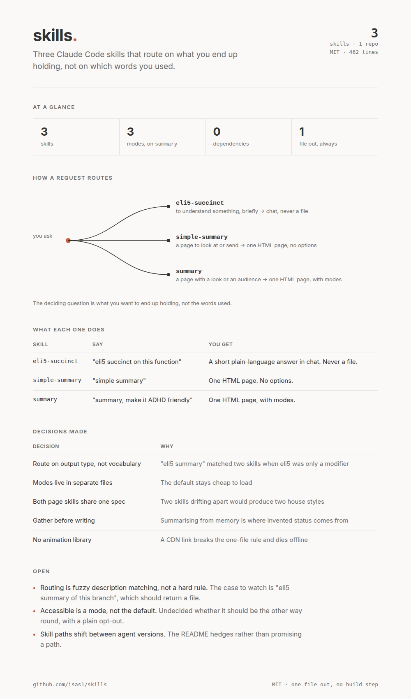

# skills

Two skills for explaining and summarising work. They route on **what you want to end up holding**, not on which words you used: an explanation in chat, or a page.

| You want | Skill | You get |
|---|---|---|
| To understand something, briefly | [`eli5-succinct`](skills/eli5-succinct/SKILL.md) | A short plain-language answer in chat. Never a file. |
| A page to look at or send | [`summary`](skills/summary/SKILL.md) | One HTML page. Plain by default, with optional modes. |

So `eli5 succinct on this regex` explains it in chat, `summary` (or `simple summary`) writes a plain page, and `summary, make it ADHD friendly` writes the same page in accessible mode.

## What it produces

This page was generated by the `summary` skill, run on this repo. One self-contained HTML file, no build step, no dependencies.

[](docs/example-summary.html)

[View the HTML](docs/example-summary.html)

## Modes

Attach one to a `summary` ask; a bare ask builds the plain page. They stack; accessible wins where it conflicts.

| Mode | Say | Spec |
|---|---|---|
| Accessible | "ADHD friendly", "autistic", "dyslexia", "accessible" | [`modes/accessible.md`](skills/summary/modes/accessible.md) |
| Artistic | "make it look good", "artistic", "designed" | [`modes/artistic.md`](skills/summary/modes/artistic.md) |
| Animated | "animate it", "make it move" | [`modes/animated.md`](skills/summary/modes/animated.md) |

## House style

`summary` builds every page, plain or moded, to the same spec:

> Create a single page HTML summary of the conversation, branch, work tree or user instructions. Make it visual and digestible without additional cognitive fatigue. Minimal text, clear flow of information. Opt for charts and diagrams over long explanations. Default to clean off-white background, `#333333` text. Create a flow for the user to follow and use typography design principles such as spacing, line height, balanced text, and Z and F reading patterns.

One self-contained file. No build step, no CDN, no framework, no external assets. `#FAF9F7` ground, `#333333` ink, one accent, an explicit cross-platform font stack, inline SVG, 65-character measure. Survives Print to PDF.

It reads the actual target before writing (`git status`, `git log`, `git diff`, the changed files) rather than summarising from memory.

## Install

```sh
cp -r skills/eli5-succinct ~/.claude/skills/
cp -r skills/summary ~/.claude/skills/
```

Install both. The routing in each description depends on the other existing.

## Licence

MIT.
