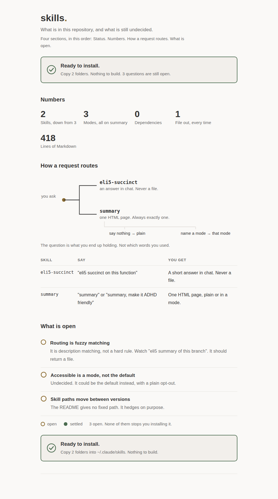
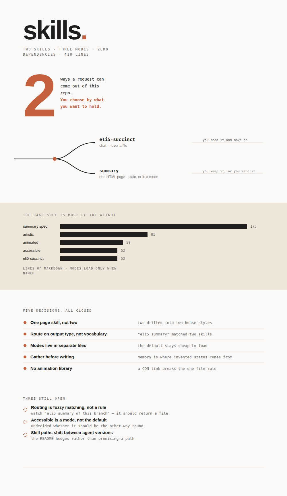
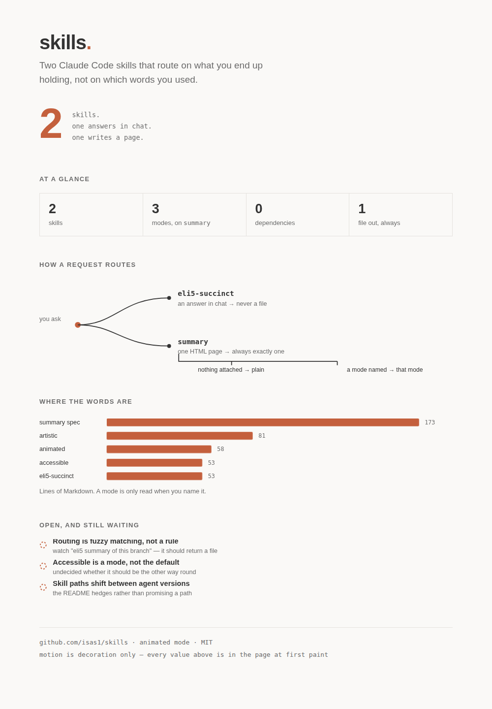

# skills

Two skills for explaining and summarising work. They route on **what you want to end up holding**, not on which words you used: an explanation in chat, or a page.

| You want | Skill | You get |
|---|---|---|
| To understand something, briefly | [`eli5-succinct`](skills/eli5-succinct/SKILL.md) | A short plain-language answer in chat. Never a file. |
| A page to look at or send | [`summary`](skills/summary/SKILL.md) | One HTML page. Plain by default, with optional modes. |

So `eli5 succinct on this regex` explains it in chat, `summary` (or `simple summary`) writes a plain page, and `summary, make it ADHD friendly` writes the same page in accessible mode.

## Don't want to install anything?

You don't need a skill for most of this. The whole idea is a couple of phrases that cut Claude's output down without losing the substance. Paste any of these straight into chat:

**Shorter answers, in chat:**

- `ELI5 succinct` — explain it plainly and briefly. Swap the number to set the audience, not the length: `ELI18` assumes a capable adult, `ELI5` assumes no background at all.
- `TL;DR, plain english` — condense what was just said, no restructuring.
- `Answer in ASD-STE100` (Simplified Technical English) — cuts verbosity while keeping full technical accuracy. Good when ELI-anything would dumb it down too far.
- `<your question> Yes or no.` then `Explain.` — forces a verdict first, detail second. Sharpens the question too.

**A page instead of a wall of text:**

```
Create a single page HTML summary of the [conversation | branch | work tree].
Make it visual and digestible without additional cognitive fatigue.
Minimal text, clear flow of information.
Opt for charts and diagrams over long explanations.
```

The skills below just package these up so you don't retype them, add routing, and enforce the house style. Take the one-liners, take the skills, or take neither — whatever saves you the most reading.

## What it produces

This page was generated by the `summary` skill, run on this repo. One self-contained HTML file, no build step, no dependencies.

[](docs/example-summary.html)

[View the HTML](docs/example-summary.html)

## Modes

Attach one to a `summary` ask; a bare ask builds the plain page. They stack; accessible wins where it conflicts.

| Mode | Say | Spec | Example |
|---|---|---|---|
| Accessible | "ADHD friendly", "autistic", "dyslexia", "accessible" | [`modes/accessible.md`](skills/summary/modes/accessible.md) | [page](docs/example-accessible.html) |
| Artistic | "make it look good", "artistic", "designed" | [`modes/artistic.md`](skills/summary/modes/artistic.md) | [page](docs/example-artistic.html) |
| Animated | "animate it", "make it move" | [`modes/animated.md`](skills/summary/modes/animated.md) | [page](docs/example-animated.html) |

Every example below is this same repo, summarised by `summary` in that mode.
The plain page above and these three carry identical facts.

| | |
|---|---|
| [](docs/example-accessible.html)<br>**Accessible** — status repeated top and bottom, literal headings, colour-coded state, no motion. | [](docs/example-artistic.html)<br>**Artistic** — one motif, the fork: a single stroke that splits once and bleeds off the page. |
| [](docs/example-animated.html)<br>**Animated** — the count rolls up, bars grow, the fork draws itself, open items breathe. Dead on paper and under `prefers-reduced-motion`. | |

## House style

`summary` builds every page, plain or moded, to the same spec:

> Create a single page HTML summary of the conversation, branch, work tree or user instructions. Make it visual and digestible without additional cognitive fatigue. Minimal text, clear flow of information. Opt for charts and diagrams over long explanations. Default to clean off-white background, `#333333` text. Create a flow for the user to follow and use typography design principles such as spacing, line height, balanced text, and Z and F reading patterns.

One self-contained file. No build step, no CDN, no framework, no external assets. `#FAF9F7` ground, `#333333` ink, one accent, an explicit cross-platform font stack, inline SVG, 65-character measure. Survives Print to PDF.

It reads the actual target before writing (`git status`, `git log`, `git diff`, the changed files) rather than summarising from memory.

## Install

```sh
cp -r skills/eli5-succinct ~/.claude/skills/
cp -r skills/summary ~/.claude/skills/
```

Install both. The routing in each description depends on the other existing.

## Licence

MIT.
